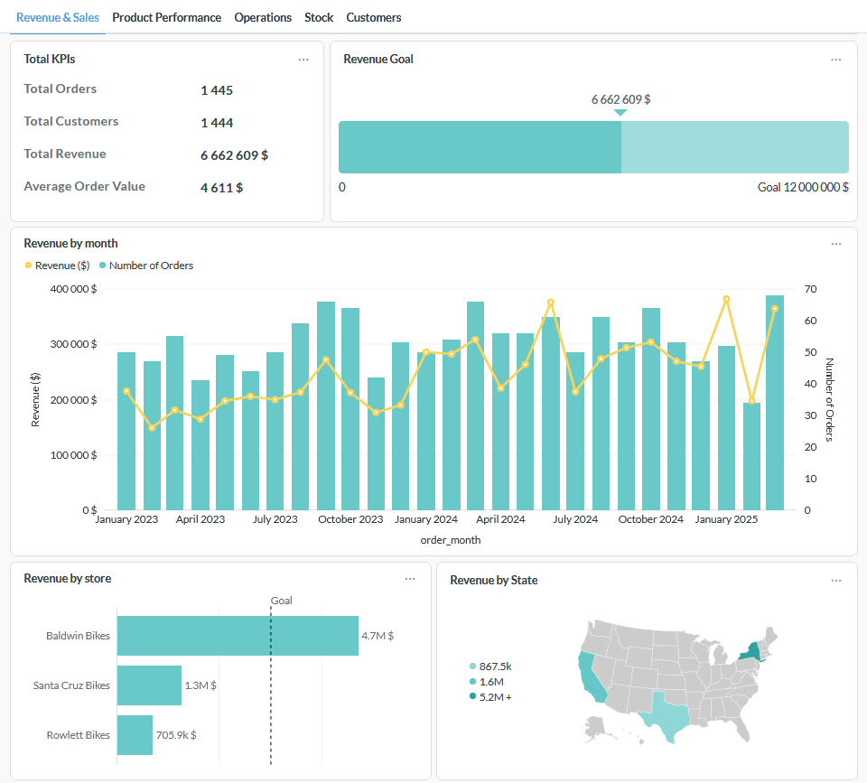

# dbt Showroom — Local Bike

This project is a end-to-end analytics engineering case study built for learning and demonstration purposes. It covers the full data workflow from raw source data to a business dashboard, using industry-standard tools and best practices.

## Business context

Local Bike is a fictional US bike retailer with three stores (Santa Cruz CA, Baldwin NY, Rowlett TX). The company wants to move from raw operational data to actionable insights to optimize sales and revenue.

The role of the analytics engineer here is to model the raw data so that the operations team can answer questions like:
- What is the revenue trend over time, by store and by product?
- Which products, categories and brands drive the most sales?
- How efficient is order fulfillment across stores?
- Which staff members generate the most revenue?
- Where are the stock imbalances across stores?

## Dashboard output

The models feed a Metabase dashboard covering revenue trends, store performance, product analysis, operations and customer geography.



## Stack

- **BigQuery** — cloud data warehouse, hosts raw and transformed data
- **dbt Cloud** — transformation layer, runs and tests all models
- **Metabase** — business intelligence, connects to the marts layer

## Project structure

```
models/
  staging/      # One view per source table. Renaming, casting, no business logic.
  intermediate/ # Optional reusable joins between staging models.
  marts/        # Denormalized tables for analytics. Only layer exposed to Looker.

tests/          # Singular tests — custom business logic validations.
macros/         # generate_schema_name override for environment isolation.
```

## Data model

The source dataset comes from two schemas:

**Sales** — customers, orders, order_items, staffs, stores

**Production** — products, categories, brands, stocks

The marts layer exposes:

| Model | Description |
|---|---|
| `fct_orders` | Fact table. One row per order line item with revenue and shipping metrics. |
| `dim_customers` | Customer dimension with geographic attributes. |
| `dim_products` | Product dimension enriched with category and brand. |
| `dim_stores` | Store dimension (the three Local Bike locations). |
| `dim_staffs` | Staff dimension with store assignment. |
| `mart_sales_performance` | Wide table joining all dimensions. Primary source for the dashboard. |

## Environment setup

The project uses three BigQuery datasets:

| Dataset | Purpose |
|---|---|
| `localbike_raw` | Source data — never modified by dbt |
| `localbike_dev_*` | Development environment — personal sandbox |
| `localbike_prod_*` | Production environment — feeds the dashboard |

Each environment has three sub-datasets: `_staging`, `_intermediate`, `_marts`.

## Running the project

Install dependencies:
```
dbt deps
```

Run and test all models:
```
dbt build
```

Run a specific model and its dependencies:
```
dbt build --select +mart_sales_performance
```

Generate and serve documentation:
```
dbt docs generate
dbt docs serve
```

## Tests

Generic tests (`not_null`, `unique`) are defined in `.yml` files alongside each model.

Singular tests covering business rules are in the `tests/` folder:

| Test | Rule |
|---|---|
| `assert_positive_revenue` | Revenue must never be negative |
| `assert_no_future_orders` | Order dates must not be in the future |
| `assert_shipped_after_ordered` | Shipment date must be after order date |
| `assert_discount_between_0_and_1` | Discount must be between 0 and 1 |
